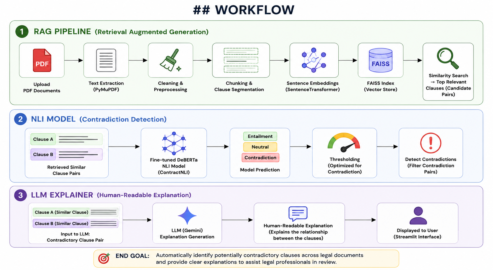
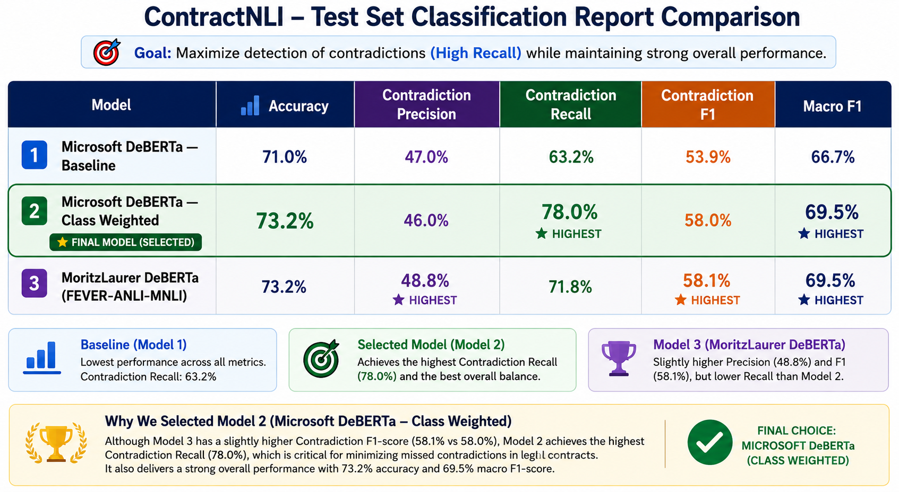
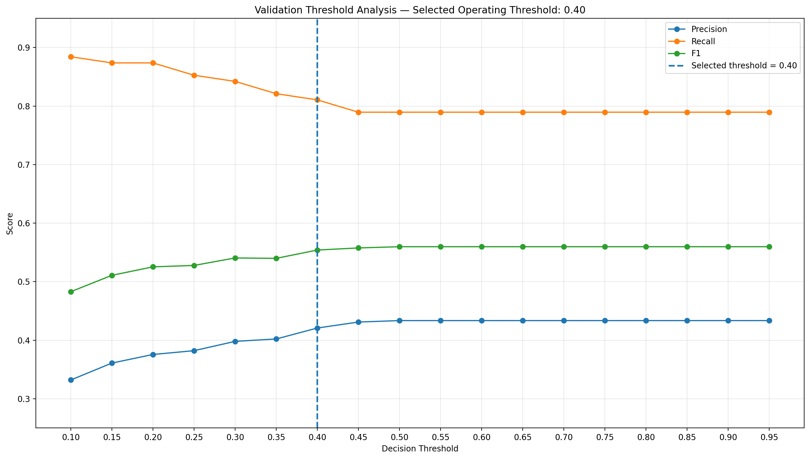
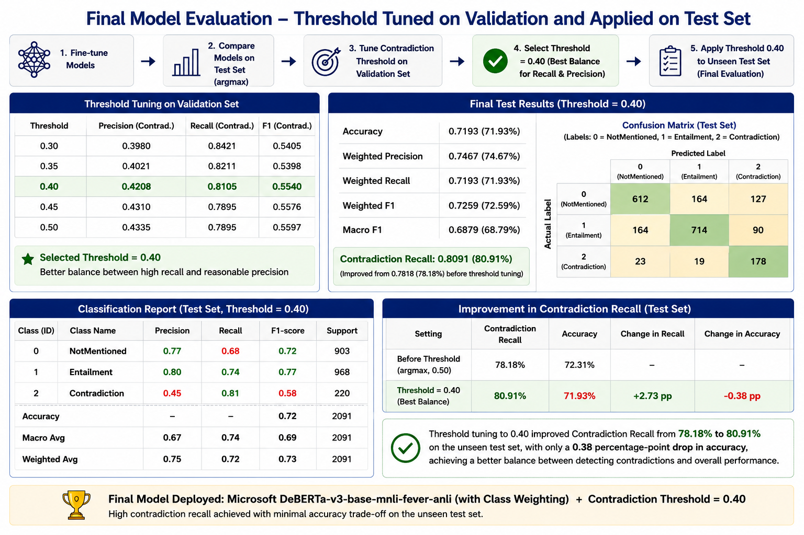

## PROBLEM STATEMENT

Organizations and law firms manage large volumes of legal documents, including contracts, NDAs, policies, and SOPs. Across these documents, clauses addressing the same or related requirements can be ambiguous, inconsistent, or contradictory.

Although legal teams review these documents, manually reading and comparing thousands of lengthy documents to identify potential conflicts is time-consuming, inefficient, and difficult to scale.

These contradictory clauses can lead to contractual disputes, compliance issues, and other legal risks.

## OBJECTIVE

The objective of this project is to build an end-to-end system that automatically processes legal documents, identifies potentially contradictory clauses across the document collection, and provides clear explanations of the detected conflicts.

The system is designed to reduce the manual effort required to review large volumes of legal documents and help legal teams and organizations efficiently identify and review potential contradictions.

## WORKFLOW

## RESULTS

### Final Model Evaluation

### Threshold Analysis

### Threshold Results

